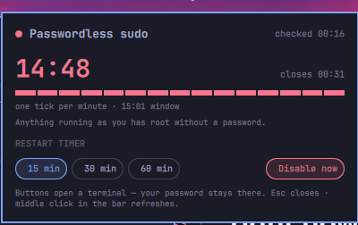
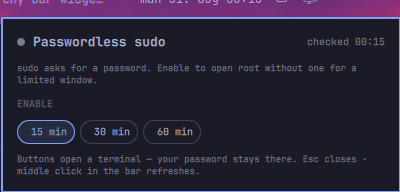

# synjan.sudo — is passwordless sudo open right now?

Omarchy's `omarchy-sudo-passwordless` opens full root without a password for a
limited window — useful for AI agents, invisible once enabled. This widget
makes the state impossible to miss: a red countdown in the bar while the
window is open, a dim glyph (or nothing) while it is closed.


| Open | Closed |
|---|---|
|  |  |

```
BarWidget ── Panel ── Service ──▶ systemctl list-timers omarchy-nopasswd-expire-$USER.timer
                                  omarchy-launch-floating-terminal-with-presentation
                                    omarchy-sudo-passwordless [MINUTES]   (actions)
```

## How it reads the state

The sudoers file (`/etc/sudoers.d/99-omarchy-nopasswd-$USER`) is root-only, so
the widget reads the transient expiry timer instead — the same signal the
toggle script trusts for its own stale check. `systemctl list-timers
--output=json` gives the deadline (`next`, epoch µs); an empty list means off.
Polling is local and cheap: every 5 s while active, every 30 s while not, and
every 2 s for a minute after you press a button (you are typing your password
in the floating terminal meanwhile).

## Panel

A large countdown with the closing time, and a fuse underneath: one tick per
minute of the window, read from the timer's `ActiveEnterTimestamp` (so it
survives shell restarts; past an hour 60 ticks share the window, and an
unknown window just hides the fuse). Duration chips restart the timer from
now — the script replaces the window, it does not add — and **Disable now**
sits apart on the right. Every action opens the same floating terminal the
SUPER+SPACE menu uses; password prompt and confirmation happen there. The
plugin never touches sudoers itself.

Notifications (primary screen only): state flipped on/off underneath the
widget, and a warning shortly before expiry.

## Install

```
omarchy plugin add https://github.com/synjan/omarchy-sudo
```

Remove again with `omarchy plugin remove synjan.sudo` — the plugin keeps no
state outside its own `~/.config/omarchy/shell.json` entry.

## Settings

Inline in the `synjan.sudo` entry of `~/.config/omarchy/shell.json`, or via
the gear in the panel: `defaultMinutes` (highlighted duration, 15),
`showWhenInactive` (dim glyph vs hidden, true), `notifySecondsBefore` (60,
0 = off), `icon` (`󰟵`).

## IPC

```
omarchy-shell synjan.sudo status
omarchy-shell synjan.sudo refresh | toggle | enable 30 | disable
```

`enable`/`disable` open the floating terminal — they cannot silently change
sudoers.

## Tests

```
node tests/model-test.mjs
```

## License and dependencies

MIT (see LICENSE). No external dependencies: state is read with `systemctl`
(no root needed), actions run Omarchy's own `omarchy-sudo-passwordless` in a
floating terminal, and the consistency probe is `sudo -n true` (never prompts).
